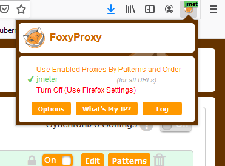
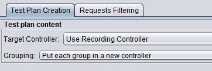

# Jmeter
Testing performance load for Django app

## Start a jmeter container 
for doing a load test against django/postgresql POC 
```shell
cd ~/edb-assessment/jmeter  # go to the relevant directory
docker build -t jmeter .   # build jmeter docker image
docker images # check  
```
## Start locally the jmeter gui 
### Recording a test plan for your Django Poll website
Install Firefox and setup the add-on named FoxyProxy  
In foxyproxy added a proxy  
Enter a title Jmeter    
Proxy Type is HTTP  
Proxy IP is localhost    
Port is 8888  
no username or password



### Create Test plan
If firefox switch to jmeter proxy

Start with your mouse over test plan and right click on it.    
1- menu  Add -> Thread -> Thread Group  
2- Righ click on Test plan -> Add -> Non-test-elements -> HTTPS Test Script Recorder
In target controller select Test Plan ->Thread Group
Grouping : Put each group in a new controller
Click on tab Request Filtering  
Click Add in URL Patterns to Exclude   
Copy and paste these excluded files
```shell script
   .*\.(txt|bmp|css|js|gif|ico|jpe?g|png|swf|woff|woff2|ttf|txt-).*
``` 
click on start in Https test script recorder the green start button  
Ok for the jmeter certificat
Open a tab an copy paste your Django Poll URL
```shell script
     http://<your ip address>:8000/polls  
```
Check if jmeter is recording all your actions by clicking on Thread Group   
Click on a question in firefox,   
and select an answer 
click  vote again 
do again randowly the previous actions
Stop recording in the small jmeter windows  
Click file, select Save Test Plan As    
Save your test plan to your git repo  as polls_test_plan.jmx

### Set JMeter variables
Add HTTP Requests Defaults variables  
Remove all IP and port from other HTTP Request action  
Move over Thread group -> right click -> Add -> Listener -> View Results Tree  

## CSRF token and generic values  
See Test Plan for all generic values     
See Regular Expression extractor to get CSRF token, it's copy as a value in the following POST screen  
Don't miss to add a HTTP cookie manager at the beginning of test plan to avoid any issue.

## Test using jmeter container

